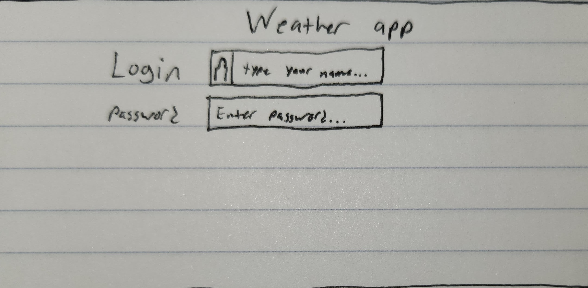
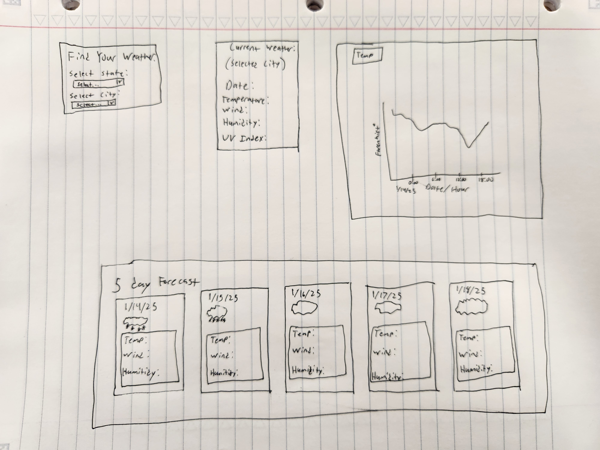

# Weather App

[My Notes](notes.md)

This Weather App is designed to keep users informed about weather conditions across various cities in the country. Key features include secure login, state and city selection for localized weather updates, saving favorite cities, real-time weather data, a 5-day forecast, and the ability to check weather conditions in friends' cities.

## 🚀 Specification Deliverable

For this deliverable I did the following. I checked the box `[x]` and added a description for things I completed.

- [x] Proper use of Markdown
- [x] A concise and compelling elevator pitch
- [x] Description of key features
- [x] Description of how you will use each technology
- [x] One or more rough sketches of your application. Images must be embedded in this file using Markdown image references.

### Elevator pitch

In today's world, we are more connected than ever. With the touch of a button, you can talk to family or friends face-to-face. But what happens if inclement weather disrupts communication, leaving you unaware of their safety?
Weather App lets you stay informed about the weather in any city across the country. From Anchorage to Miami, you can always know what's happening and ensure your loved ones are safe, no matter the conditions.

### Design

### Key features

- Secure Login: Protect your account with HTTPS for safe and encrypted access.
- State and City Selection: Easily choose the state and city you want to view for localized weather updates.
- Favorite Cities: Save your favorite cities and have them remembered automatically the next time you log in.
- Real-Time Data: Access up-to-the-minute details on temperature, humidity, wind speed, and UV index.
- 5-Day Forecast: Plan ahead with a 5-day weather forecast.
- Friends’ Cities: Check the weather conditions in your friends’ cities to stay connected and informed.

### Technologies

I am going to use the required technologies in the following ways.

- **HTML** - Will use HTML for the structure of the application. One login page and one for weather display
- **CSS** - Application styling to improve user experience on different screen sizes, formatting, and coloring
- **React** - Provides routing capabilities for navigating between the Login Page and Weather Display Page.
- **Service** - Backend services with endppoints for:
    - Login
    - City and state selection
    - Retriving weather data
- **DB/Login** - Store users and their favorite cities. Register and login users.
- **WebSocket** - As users view cities, friends can see what cities they viewed. 

## 🚀 AWS deliverable

For this deliverable I did the following. I checked the box `[x]` and added a description for things I completed.

- [x] **Server deployed and accessible with custom domain name** - [My server link](https://startup.moorewebdev260.click).

## 🚀 HTML deliverable

For this deliverable I did the following. I checked the box `[x]` and added a description for things I completed.

- [x] **HTML pages** - Created my index.html(login) and weather.html(display) pages.
- [x] **Proper HTML element usage** - Use proper tags such as BODY, NAV, HEADER, FOOTER.
- [x] **Links** - My pages contain links between them.
- [x] **Text** - My pages contain text.
- [x] **3rd party API placeholder** - My third party API will supply my weather data, placeholder currently present.
- [x] **Images** - My weather page contains images. 
- [x] **Login placeholder** - Index.html contains a login placeholder.
- [x] **DB data placeholder** - My live weather data will come from my DB, placeholder present.
- [x] **WebSocket placeholder** - Friends section of weather.html acting as placeholder. 

## 🚀 CSS deliverable

For this deliverable I did the following. I checked the box `[x]` and added a description for things I completed.

- [x] **Header, footer, and main content body** - Styled my header, body, and footer with CSS.
- [x] **Navigation elements** - Created active links to other parts of the page and GitHub.
- [x] **Responsive to window resizing** - Used CSS to have responsive window resizing.
- [x] **Application elements** - Done.
- [x] **Application text content** - Used css to style my applications text.
- [x] **Application images** - My application contains images. 

## 🚀 React part 1: Routing deliverable

For this deliverable I did the following. I checked the box `[x]` and added a description for things I completed.

- [x] **Bundled using Vite** - Bundled it using Vite.
- [x] **Components** - Components present.
- [x] **Router** - Routing between login and voting components.

## 🚀 React part 2: Reactivity

For this deliverable I did the following. I checked the box `[x]` and added a description for things I completed.

- [x] **All functionality implemented or mocked out** - All parts of the app are functional or mocking functionality.
- [x] **Hooks** - With hooks.

## 🚀 Service deliverable

For this deliverable I did the following. I checked the box `[x]` and added a description for things I completed.

- [ ] **Node.js/Express HTTP service** - I did not complete this part of the deliverable.
- [ ] **Static middleware for frontend** - I did not complete this part of the deliverable.
- [ ] **Calls to third party endpoints** - I did not complete this part of the deliverable.
- [ ] **Backend service endpoints** - I did not complete this part of the deliverable.
- [ ] **Frontend calls service endpoints** - I did not complete this part of the deliverable.

## 🚀 DB/Login deliverable

For this deliverable I did the following. I checked the box `[x]` and added a description for things I completed.

- [ ] **User registration** - I did not complete this part of the deliverable.
- [ ] **User login and logout** - I did not complete this part of the deliverable.
- [ ] **Stores data in MongoDB** - I did not complete this part of the deliverable.
- [ ] **Stores credentials in MongoDB** - I did not complete this part of the deliverable.
- [ ] **Restricts functionality based on authentication** - I did not complete this part of the deliverable.

## 🚀 WebSocket deliverable

For this deliverable I did the following. I checked the box `[x]` and added a description for things I completed.

- [ ] **Backend listens for WebSocket connection** - I did not complete this part of the deliverable.
- [ ] **Frontend makes WebSocket connection** - I did not complete this part of the deliverable.
- [ ] **Data sent over WebSocket connection** - I did not complete this part of the deliverable.
- [ ] **WebSocket data displayed** - I did not complete this part of the deliverable.
- [ ] **Application is fully functional** - I did not complete this part of the deliverable.